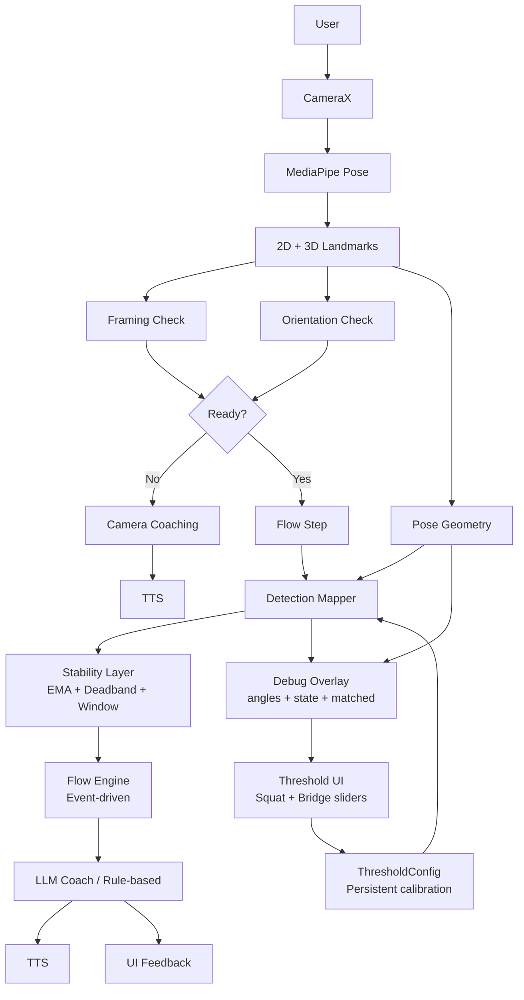

# YogaFlow 3D

> **自己的資訊，自己掌控。數據零離機，專業不妥協。**

YogaFlow 3D is a demo-ready on-device AI yoga coach for Android. It turns live camera frames into 3D pose geometry, maps the user’s body state to structured yoga flow steps, and gives real-time voice coaching through local LLM + TTS.

---

## Release Milestone

```text
v0.2-threshold-ui
Runtime threshold tuning + persistent user calibration
```

This milestone adds a complete tuning loop:

```text
Debug Overlay → Threshold UI → ThresholdConfig → Pose Mapper → FlowEngine
```

---

## Demo

```text
Beginner Class
Mountain → Forward Fold → Twist → Squat → Bridge
```

- Platform: Android
- Runtime: On-device camera + pose + coach loop
- Coaching mode: live correction + flow progression
- Debug mode: live pose angle / state / matched overlay
- Tuning mode: runtime Squat / Bridge threshold sliders
- Calibration: persisted user thresholds via SharedPreferences
- Privacy: no camera frames or pose landmarks need to leave the device

---

## System Architecture



Full system architecture: [`docs/architecture.md`](docs/architecture.md)

---

## Why this is hard

Real-time AI coaching is harder than pose detection alone.

- Live pose landmarks are noisy and jitter frame by frame.
- Yoga coaching needs step-level context, not only a final pose label.
- Flow transitions must avoid skipped steps, repeated triggers, and timer bugs.
- Coaching must prioritize camera setup before body correction.
- Thresholds need to be tunable because body proportions, camera angle, and movement range vary across users.
- The system must feel human while running fully on-device.

YogaFlow solves this with a deterministic runtime core:

```text
Flow step.detect
→ Detection Mapper
→ Smoothing + Stability Window
→ FlowEvent
→ LLM/TTS Coaching
```

The deterministic system decides **what** to say. The LLM decides **how** to say it.

---

## Current Product State

YogaFlow 3D currently supports a full beginner class with multi-pose chaining:

```text
Mountain → Forward Fold → Twist → Squat → Bridge
```

The runtime supports:

- camera setup coaching before pose correction
- flow-driven class progression
- step-level pose detection mapping
- event-driven flow runtime
- local LLM coaching on a background executor
- TTS voice coaching
- stability-aware multi-pose detection
- live debug overlay for threshold tuning
- runtime threshold sliders for Squat and Bridge
- persisted threshold calibration across app restarts

---

## Implemented Features

### Core Runtime

- Flow DSL (`.flow.txt`)
- Flow parser
- Event-driven `PoseFlowEngine`
- Flow playlist for multi-flow classes
- Auto flow discovery from `assets/flows`
- Flow step-level `detect` mapping
- `PoseDetectionRouter` for mapper dispatch

### Camera + Pose Pipeline

- `CameraPosePipeline`
- `PoseHelper` / MediaPipe Pose
- `PoseDetectionResult`
- 2D image landmarks for overlay
- 3D world landmarks for geometry
- Camera start error callback

### Perception + Mapping

- `CameraFramingCoach`
- `ViewOrientation`
- `PoseGeometry`
- `PoseDetectionRouter`
- `ForwardFoldDetectionMapper`
- `TwistDetectionMapper`
- `SquatDetectionMapper`
- `BridgeDetectionMapper`

### Runtime Stability

- EMA angle smoothing
- angle deadband
- stability window before accepting matched state
- mapper reset on playlist restart / flow transition
- coach cue throttle
- LLM generation off UI thread
- safe flow loading with `runCatching`

### Debugging + Observability

- `DebugPoseInfo`
- live `debugText` overlay
- current pose id
- current `detect`
- mapper state
- `matched` result
- left/right knee angle
- left/right hip angle
- torso twist estimate

### Runtime Tuning + Calibration

- `ThresholdConfig`
- Squat knee threshold slider
- Bridge hip threshold slider
- mapper-driven dynamic threshold updates
- persisted threshold values with SharedPreferences
- closed tuning loop with debug overlay feedback

### AI + Voice

- Local LLM coach / fallback coach
- Coach phrase polishing
- TTS voice coaching
- UI text separated from spoken text

---

## Supported Live-Coached Poses

| Pose | Mapper | Primary geometry | Flow detects | Runtime tuning |
|---|---|---|---|---|
| Forward Fold | `ForwardFoldDetectionMapper` | bilateral knee + hip angles | `ready_forward_fold`, `tall_spine_setup`, `hip_hinge`, `controlled_forward_fold`, `forward_hold`, `return_standing`, `neutral_finish` | — |
| Twist | `TwistDetectionMapper` | torso twist estimate | `stable_base`, `twist_start`, `twist_hold`, `return_center` | — |
| Squat | `SquatDetectionMapper` | bilateral knee angles | `squat_setup`, `squat_descent`, `squat_hold`, `squat_return` | knee hold max threshold |
| Bridge | `BridgeDetectionMapper` | bilateral hip angles | `bridge_setup`, `bridge_lift`, `bridge_hold`, `bridge_return` | hip lift / hold max threshold |

---

## Flow DSL Example

```text
[STEP 3]
state = HOLD
duration_ms = 7000
cue = 停在穩定深蹲位置，胸口打開，保持呼吸。
detect = squat_hold
correction = 如果太低，往上回一點；如果太高，再慢慢下去一點。
```

A flow file defines the class content. A detection mapper decides whether the user actually satisfies the current step.

---

## Debug Overlay Example

```text
DEBUG
pose=squat
detect=squat_hold
state=HOLD matched=true
L knee=91.2° R knee=89.8°
L hip=110.3° R hip=108.7°
twist=2.1°
```

The overlay is used for threshold tuning, jitter observation, and validating why a step is or is not matched.

---

## Threshold Tuning Example

```text
Squat knee: 105°
Bridge hip: 155°
```

The tuning panel updates `ThresholdConfig` at runtime. Squat and Bridge mappers read the current values immediately, and the selected values are persisted across app restarts.

---

## Privacy Model

YogaFlow is designed for on-device execution.

```text
Camera frame
→ on-device pose inference
→ on-device geometry
→ on-device flow state
→ on-device coach cue
→ local TTS
```

No camera frames or pose landmarks are required to leave the device for the core coaching loop.

---

## Requirements

- Android 15+
- High-end Android device recommended
- NPU / 12GB RAM recommended for local LLM use

---

## Roadmap

- Extract mapper interface (`PoseDetectionMapper`)
- Add visual body framing box overlay
- Add variance-based stability scoring
- Add threshold reset button
- Add auto calibration
- Add more pose families
- Replace cover drawable with real generated images (#13)

---

## Tags

`#Android15` `#MediaPipe` `#LocalLLM` `#OnDeviceAI` `#3DPose` `#CameraCoaching` `#RuntimeTuning` `#OnDeviceYogaCoach`
